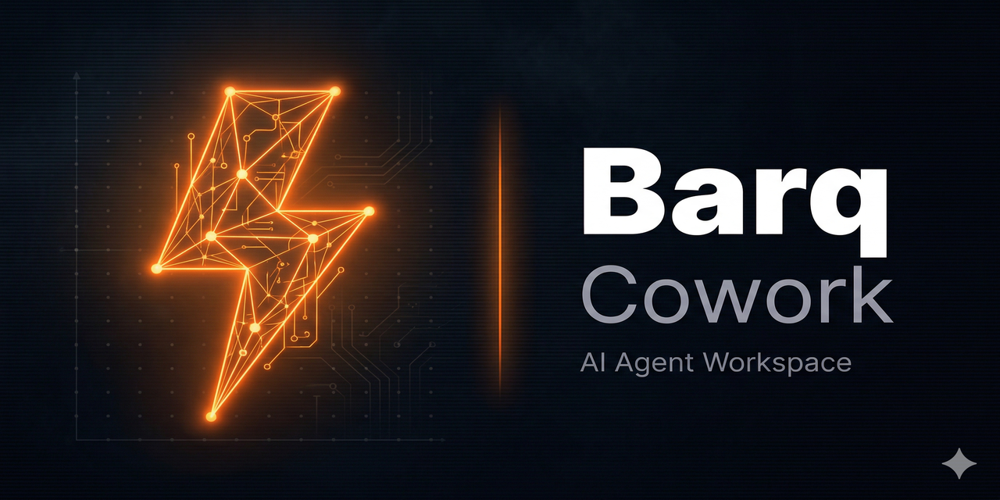
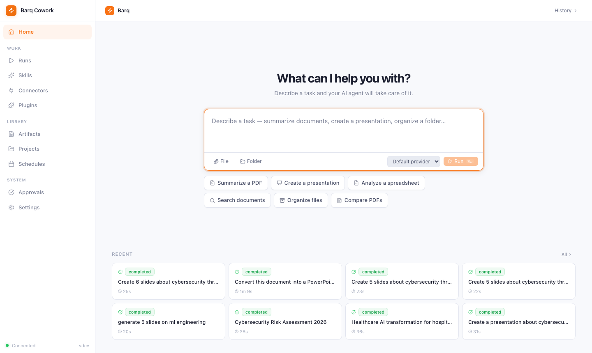
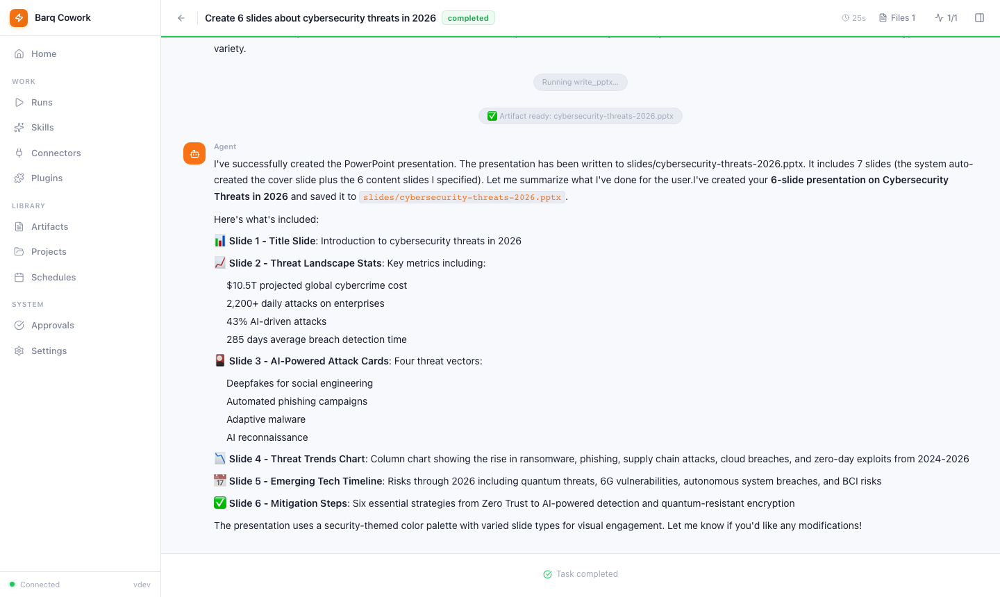
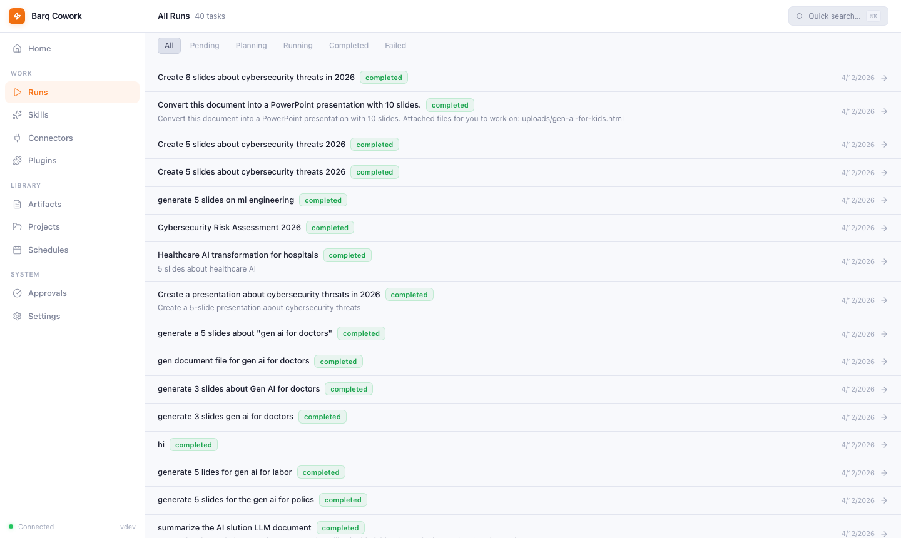

<div align="center">



[](https://github.com/YASSERRMD/barq-cowork/releases)
[](https://go.dev/)
[](https://www.rust-lang.org/)
[](https://react.dev/)
[](https://tauri.app/)
[](LICENSE)

**AI-powered document intelligence workstation**

[Overview](#overview) · [Features](#features) · [Screenshots](#screenshots) · [Architecture](#architecture) · [Getting Started](#getting-started) · [PPTX Themes](#pptx-themes)

</div>

---

## Overview

Barq Cowork is an AI-powered desktop workstation for document intelligence tasks. It provides a conversational interface backed by LLM agents that plan and execute multi-step document processing workflows entirely on your machine.

The application generates professional PowerPoint presentations, Word documents, and PDF reports from natural-language prompts or uploaded source files. All processing is handled by a self-contained Go binary bundled inside the Tauri desktop shell. No cloud processing is required beyond your LLM API key.

---

## Features

- Interactive chat interface with an AI agent for natural-language document requests
- Full-width conversation view with real-time task progress indicators
- Slide-out panel displaying step-by-step execution details and generated file output
- PowerPoint generation from prompts or uploaded documents, with multiple professional theme presets
- Pure Go PPTX engine — no Python or external dependencies required
- Word document (DOCX) generation for reports, summaries, and structured analysis
- PDF document processing and generation
- HTML-to-PPTX conversion with themed slide layouts
- File upload and inline document preview
- Artifact management with automatic capture and browsing of produced files
- Multi-provider LLM support: OpenAI, Anthropic, Gemini, Ollama, Z.AI, and any OpenAI-compatible endpoint
- API keys stored locally; no environment variables or cloud accounts required
- Cross-platform desktop application for macOS (Apple Silicon and Intel) and Windows 10/11

---

## Screenshots

<div align="center">



*Home — describe a task in plain language and run it instantly*

<br/>



*Task run — full-width agent conversation with live step execution and file output*

<br/>



*Runs — searchable history of all completed and in-progress tasks*

</div>

---

## Architecture

The application consists of two main components:

**Frontend (React + Tauri)**
A React 18 / TypeScript single-page application rendered inside a Tauri v2 desktop shell. The UI provides the chat composer, conversation view, step panel, file upload, and artifact browser. Tauri manages the native window, file system access, and the sidecar process lifecycle.

**Backend (Go)**
A single self-contained Go binary (`barq-coworkd`) that Tauri spawns as a managed sidecar process. It exposes a JSON REST API on `localhost:7331` and handles all agent orchestration, document generation, LLM provider calls, and artifact storage. The PPTX engine is written entirely in Go using a custom slide layout and theme system.

```
Tauri Shell (Rust)
  React Frontend  <-->  barq-coworkd (Go)  <-->  LLM Providers
                           SQLite storage
                           PPTX / DOCX / PDF engine
```

---

## Getting Started

### Prerequisites

- macOS 12+ or Windows 10/11
- An API key for any supported LLM provider (OpenAI, Anthropic, Gemini, or compatible)

### Download

Download the latest installer from [Releases](https://github.com/YASSERRMD/barq-cowork/releases):

| Platform | File |
|----------|------|
| macOS (Apple Silicon) | `Barq_Cowork_*_aarch64.dmg` |
| macOS (Intel) | `Barq_Cowork_*_x64.dmg` |
| Windows 10/11 | `Barq_Cowork_*_x64-setup.exe` |

### First Run

**macOS only:** After dragging `Barq Cowork.app` to `/Applications`, download `mac-setup.command` from the same release page and double-click it to remove the macOS quarantine flag. This is a one-time step until the app is notarized.

1. Launch the app. The backend starts automatically in the background.
2. Open **Settings** and add your LLM provider with its API key and endpoint.
3. Start a new conversation and describe the document you need.
4. The agent will plan and execute the task, streaming progress in the step panel.
5. Download the generated files from the artifacts panel when complete.

### Building from Source

```bash
# Build the Go sidecar (macOS ARM example)
cd backend
GOOS=darwin GOARCH=arm64 CGO_ENABLED=0 \
  go build -trimpath -ldflags="-s -w" \
  -o ../apps/desktop/src-tauri/binaries/barq-coworkd-aarch64-apple-darwin \
  ./cmd/barq-coworkd

# Install frontend dependencies
cd ../apps/desktop && npm ci

# Development mode with hot reload
npm run tauri dev

# Production bundle
npm run tauri build
```

See [docs/building.md](docs/building.md) for the full cross-platform build guide.

---

## PPTX Themes

The Go PPTX engine ships with coordinated theme palettes for professional presentations across multiple industries:

| Theme | Description |
|-------|-------------|
| `tech` | Dark navy with electric blue accents — suitable for technology and software topics |
| `healthcare` | Clean white with teal accents — clinical and professional |
| `security` | Dark charcoal with amber warnings — appropriate for cybersecurity content |
| `finance` | Conservative navy with gold accents — suited for financial and business reporting |
| `education` | Warm white with indigo accents — clear and accessible for academic content |
| `creative` | Vibrant gradients with bold accent colors — for design and marketing presentations |
| `minimal` | Pure white with subtle gray — distraction-free and universally appropriate |
| `corporate` | Standard blue and gray — compatible with enterprise style guides |

Themes are specified in the chat prompt or set as a default in Settings. Each theme applies coordinated colors to slide backgrounds, title text, body text, accent shapes, and chart palettes.

---

## Repository Structure

```
barq-cowork/
├── backend/                        # Go service
│   ├── cmd/barq-coworkd/main.go    # Entry point
│   └── internal/
│       ├── domain/                 # Core types and errors
│       ├── provider/               # LLM provider abstraction and retry logic
│       ├── orchestrator/           # Planner, Executor, Sub-agent pool
│       ├── service/                # Business logic and tool registry
│       ├── store/sqlite/           # SQLite adapters and migrations
│       └── api/v1/                 # HTTP handlers
│
├── apps/desktop/                   # Tauri + React application
│   ├── src/
│   │   ├── pages/                  # Route-level page components
│   │   ├── components/             # Shared UI components
│   │   ├── lib/api.ts              # Typed REST client
│   │   └── store/appStore.ts       # Zustand global state
│   └── src-tauri/
│       ├── src/lib.rs              # Sidecar lifecycle manager
│       └── tauri.conf.json         # Tauri configuration
│
├── docs/
│   ├── banner.png                  # Repository banner
│   ├── screenshots/                # UI screenshots
│   └── building.md                 # Full build guide
└── .github/workflows/release.yml  # CI/CD release workflow
```

---

## License

MIT — see [LICENSE](LICENSE).

---

<div align="center">
  <sub>Built with Go · Rust · React · Tauri · SQLite</sub>
</div>
